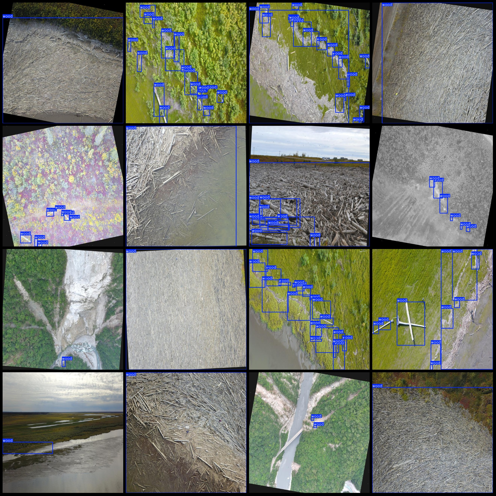
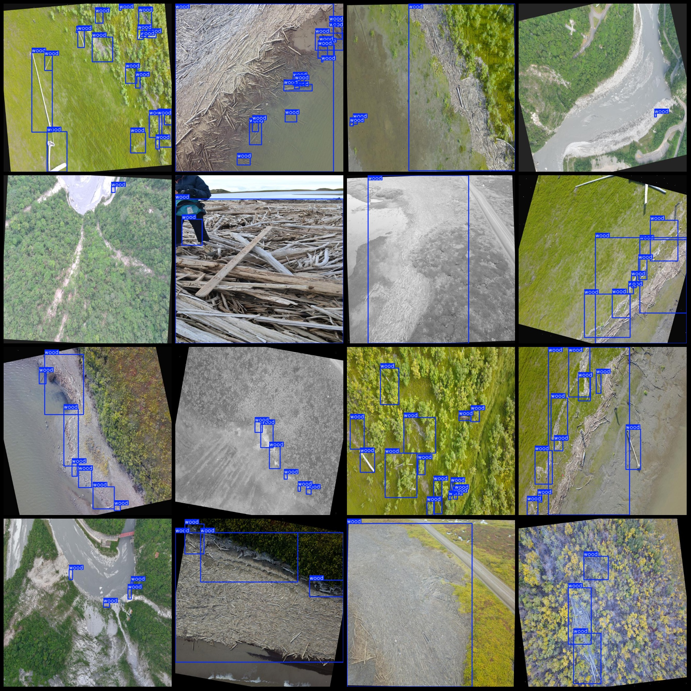

# Drone-View Riverbank Floating Debris Detection Dataset VOC+YOLO format with 1 category

```markdown
# Drone Perspective Riverbank Logging Detection Dataset VOC+YOLO Format: 1345 Images, 1 Category

Note: Approximately 570 images are original, with the remaining enhanced. The main algorithm is rotation enhancement.

Dataset format: Pascal VOC format + YOLO format (excluding txt files for segmentation paths, only including jpg images along with corresponding VOC format xml files and yolo format txt files).

Number of images (jpg file count): 1345
Number of annotations (xml file count): 1345
Number of annotations (txt file count): 1345
Number of annotation categories: 1
Annotation category name: ["wood"]
Number of bounding boxes per category: 7880
Total number of bounding boxes: 7880
Number of images occupied by each category: 1345
Image resolution: 640x640
Drone: DJI MAVIC 3
Collection height: 50m
Collection angle: 90°
Annotation tool used: labelImg
Annotation rules: draw bounding boxes for categories
Important note: The dataset does not have a split into training, validation, or test sets; users must manually divide it.
Special declaration: This dataset does not guarantee the accuracy of the trained models or weight files.
Image preview:
Annotation example:
```

## Images





Here is a pay link on Stripe ( https://buy.stripe.com/3cs8yP7sY87d0vu9AB ). Please contact me lonlonago@foxmail.com after funding $89, and I will send you a complete data files , thank you!


